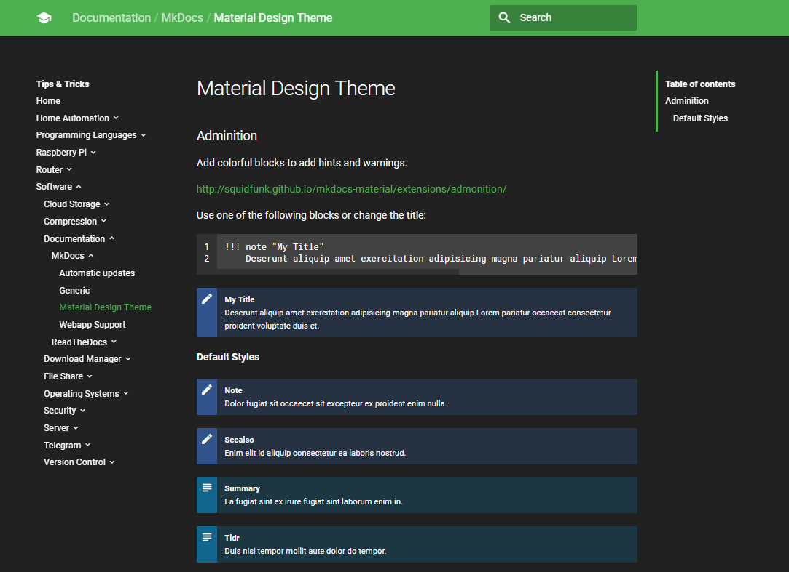

# MkDocs-Material-Dark-Theme
A dark theme for the mkdocs-material theme



# Usage

If you only want to use the dark theme you can just copy the css files and add them 
using the **extra_css** yaml notation.

However this repository also enables the use of a web app.
To also use this the **theme** folder and **theme_dir** configuration is required.

**The following assumes you want to use both dark theme and webapp ability.**

## Copy the files

Copy the contents of this repository to your root documentation path.

```
==documentation
  ==docs
    ==SomeSubFolder
    ==stylesheets
      --dark_theme.css
      --codehilite.css
    --MyDocument.md
    etc.
  ==theme
    --main.html
    --manifest.json
    etc.
```

## Modify your configuration

Then add the following to your ```mkdocs.yaml``` file:

```
# Documentation and theme
theme:
  name: 'material'
  custom_dir: 'theme'
  palette:
    primary: 'green'
    accent: 'light green'

extra_css:
  - stylesheets/dark_theme.css
  - stylesheets/codehilite.css
```

Make sure to change values like **name** and **icons** in ```manifest.json``` to your liking.
